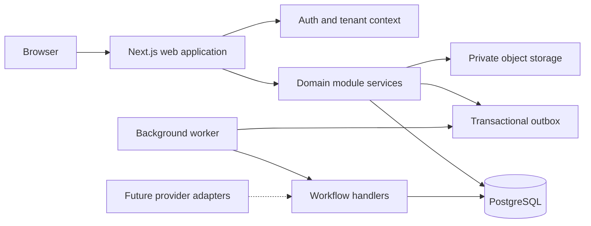

# Operations Intelligence System

## Architecture decision document — Phase 1 approved revision

**Status:** Approved for Phase 2 planning  
**Scope:** MVP implementation only; extensibility is retained where it protects future product direction.  
**Explicitly excluded:** dashboard UI, operational UI, live third-party integrations, and production AI features.

## 1. Executive decision

The product will begin as a **modular TypeScript monolith**: a single Next.js deployment, PostgreSQL database, object storage, and a separate background-worker process. It is deliberately not a microservices system.

This provides the MVP with reliable tenant isolation, a relational operational data model, auditability, and asynchronous workflows while avoiding the deployment and coordination cost of distributed services. Module boundaries, provider interfaces, and domain events leave a clear path for later integrations and intelligence features.

## 2. MVP boundary

### Build in Phase 2

- Project foundation and deployment environments
- Authentication, company membership, tenant context, and RBAC
- PostgreSQL schema and migrations for the operational core
- Secure document-file metadata and object-storage boundary
- Audit activity logging
- Domain-event outbox and background-job foundation
- Service, repository, validation, and API conventions
- Automated tests and CI baseline

### Design for, but defer

- Dashboard and KPI read models
- Driver, vehicle, inspection, defect, task, maintenance, and document user interfaces
- Configurable workflow designer
- Real notification delivery beyond the in-app data model
- Fleetio, MyTrucking, Xero, Google, GPS/telematics, and other connectors
- AI calls, chat, recommendations, or vector search
- Custom roles, SSO, and advanced enterprise controls

This split ensures Phase 2 creates a usable platform foundation without pretending that deferred features are already implemented.

## 3. Recommended technology stack

| Concern | Decision | Rationale |
|---|---|---|
| Web application | Next.js App Router, React, TypeScript | Cohesive full-stack TypeScript application; supports server rendering and API endpoints. |
| UI system | Tailwind CSS, shadcn/ui | Fast, accessible design-system base when product UI begins. |
| Database | Managed PostgreSQL 16+ | Strong constraints, transactions, indexing, JSON support, and mature operational tooling. |
| Data access | Prisma ORM + reviewed SQL migrations | Type-safe application access with an escape hatch for RLS, composite constraints, and advanced indexes. |
| Authentication | Auth.js + Prisma adapter; Argon2id credentials | Keeps identity close to the product initially; provider boundary enables future SSO. |
| Background work | Redis + BullMQ worker | Durable retries and scheduled work without prematurely introducing a workflow platform. |
| Files | Private S3-compatible object storage | Large documents/photos stay out of the database; signed access is supported. |
| Validation | Zod | Shared, typed server input validation. |
| Observability | Sentry, structured JSON logs, OpenTelemetry-compatible tracing | Practical incident diagnosis from the beginning. |
| Delivery | Vercel or container host; managed Postgres/Redis/storage | Low operations burden initially; portable because the app and worker are container-compatible. |

## 4. High-level architecture



Rules:

- UI and HTTP handlers may not write business data directly through Prisma.
- A module service validates input, authorises the actor, performs the transaction, writes audit activity, and emits domain events.
- Background side effects originate from outbox events rather than UI code.
- Provider-specific SDKs remain behind integration, notification, storage, and AI interfaces.

## 5. Application structure

```text
src/
  app/                     # Routes, layouts, API route handlers
  components/              # Shared presentation components only
  modules/                 # Domain-owned application services
    companies/
    identity/
    drivers/
    vehicles/
    inspections/
    defects/
    maintenance/
    tasks/
    documents/
    activities/
  auth/                    # Session, tenant-context, permission checks
  db/                      # Prisma client, repositories, transaction helpers
  services/
    events/                # Domain event types and outbox publishing
    workflows/             # Event handlers / business workflows
    storage/               # Object-storage contract and adapter
    notifications/         # Channel contract and persistence
    integrations/          # Provider contract; no provider implementation yet
    ai/                    # Provider and insight contracts; no calls yet
  workers/                 # Queue consumers and scheduled jobs
  lib/                     # Validation, errors, logging, time utilities
  tests/
prisma/
  schema.prisma
  migrations/
```

## 6. Data model

### Modelling conventions

- UUIDv7 primary keys.
- `created_at`, `updated_at`, and `company_id` on every tenant-owned entity.
- Global `users` are separate from `company_memberships`; this supports future membership in more than one company.
- Operational records reference both `company_id` and their parent/subject record where it prevents cross-tenant links.
- Deleting business records is exceptional. Use status, archival, and immutable activity records instead.

| Entity | Purpose and MVP fields | Key relationships / indexes |
|---|---|---|
| `companies` | Tenant; `name`, `slug`, `timezone`, `status` | Unique `slug` |
| `users` | Global identity; auth provider ID, email, display name, status | Unique provider identity and email as appropriate |
| `company_memberships` | A user in a company; `company_id`, `user_id`, `role` | Unique `(company_id, user_id)`; index by user |
| `roles` / `permissions` | Seeded role-to-capability model | Initial roles: OWNER, ADMIN, MANAGER, SUPERVISOR, DRIVER |
| `locations` | Depot/site; name, address, status | Index `(company_id, status)` |
| `drivers` | Operational driver profile; optional `user_id`, employee number, licence status, status | Unique `(company_id, employee_number)`; index `(company_id, status)` |
| `vehicles` | Registration, VIN, classification, status, location | Unique `(company_id, registration)`; index `(company_id, status)` |
| `document_files` | Object metadata: storage key, size, MIME type, checksum, scan status | Storage key unique; no binary data |
| `driver_documents` | Driver document type, expiry, `driver_id`, `file_id` | Index `(company_id, expires_at)` |
| `vehicle_documents` | Vehicle document type, expiry, `vehicle_id`, `file_id` | Index `(company_id, expires_at)` |
| `inspection_templates` / `inspection_template_items` | Future configurable inspection definition | Keep schema ready; no UI in this phase |
| `inspections` | Submission header: driver, vehicle, status, odometer, submitted time | Index `(company_id, vehicle_id, submitted_at DESC)` |
| `inspection_items` | Template snapshot, answer, note, photo reference | Parent inspection relationship |
| `defects` | Source inspection item, vehicle, severity, state, assignee | Index `(company_id, status, severity)` |
| `vehicle_status_history` | Immutable vehicle state changes and reason | Index `(company_id, vehicle_id, occurred_at DESC)` |
| `maintenance_records` | Planned/completed work, costs, dates, linked defect | Vehicle / due-date indexes |
| `tasks` | Status, priority, due date, assignee, optional subject links | Assignee/status/due-date indexes |
| `notifications` | In-app record; type, payload, read timestamp | Index `(company_id, user_id, read_at)` |
| `activities` | Immutable audit event; actor, action, entity, request ID, metadata | Index `(company_id, occurred_at DESC)` and entity lookup |
| `integrations` | Provider config state and encrypted credential reference | Unique connected provider/account per company |
| `integration_sync_runs` | Cursor, timing, result, error summary | Index `(integration_id, started_at DESC)` |
| `external_entity_mappings` | Core/provider ID mapping and provenance | Unique provider entity mapping |
| `ai_insights` | Future generated insight and evidence | Index `(company_id, status, created_at DESC)` |
| `outbox_events` | Event type, aggregate, payload, status, attempts, availability | Index `(status, available_at)` |

## 7. Authentication, tenancy, and RBAC

### Authentication

- Auth.js owns session issuance and secure HTTP-only session cookies.
- Credential passwords, if enabled, are hashed with Argon2id; plaintext credentials and reset tokens are never stored.
- The identity layer is wrapped behind an `AuthProvider` contract to permit later OIDC/SAML SSO without rewriting domain services.

### Tenant isolation

1. Session identity resolves to an allowed `company_membership`.
2. The server establishes an immutable `TenantContext` containing company, membership, role, and actor ID.
3. Every module service and repository requires that context.
4. Every query filters by `company_id`.
5. PostgreSQL Row-Level Security is added to tenant tables as defence in depth; policies use a transaction-local tenant setting.
6. Composite foreign-key constraints are used where practical to ensure linked tenant records share a company.

No client-supplied company ID may be trusted as authority. A user selecting an active company is permitted only if a membership exists.

### RBAC

Roles map to permissions such as `vehicles.read`, `vehicles.manage`, `inspections.submit`, `defects.manage`, `reports.read`, and `company.manage`. Authorisation evaluates permissions and record scope. For example, a driver may have `inspections.submit` but only for themselves and assigned vehicles.

## 8. API, workflow, and event architecture

Route handlers are thin: authenticate, validate Zod input, invoke a domain service, and map errors. Module service methods own all domain mutation.

Each mutation transaction writes the business record, relevant activity entry, and an `outbox_events` entry. The worker claims events idempotently and invokes handlers.

```text
Inspection submitted
  → InspectionSubmitted outbox event
  → workflow handler evaluates submitted data
  → creates defect/task/notification when criteria apply
  → records activity and new events
```

Initial typed events include `InspectionSubmitted`, `DefectCreated`, `DefectStatusChanged`, `VehicleStatusChanged`, `TaskCreated`, `TaskCompleted`, and `DocumentExpiring`.

Rules are code-defined for the MVP. A visual/custom workflow builder is deferred until real customer workflow patterns are understood.

## 9. Provider boundaries

### Integration contract

```text
IntegrationProvider
  authenticate()
  disconnect()
  import(cursor)
  export(payload)
  sync()
```

The core model remains canonical. Provider adapters translate external payloads into internal commands and retain provenance in external mappings. No actual connector is part of Phase 2.

### AI contract

```text
AIProvider
  generateStructuredInsight(input) -> validated structured result

InsightEngine
  gathers tenant-authorised facts, invokes provider, stores evidence/confidence
```

No provider SDK, generative call, or customer data transmission is implemented in Phase 2.

### Notification contract

The first durable component is the `notifications` table. Later channels implement a common `NotificationChannel` interface for in-app, email, SMS, and push delivery. Delivery retries and provider-specific logs remain separate from the logical notification.

### File storage

Files upload directly from the browser to a private bucket through short-lived signed URLs. PostgreSQL records ownership and metadata only. A worker later scans files and marks them available or rejected. Download URLs are generated only after tenant and permission checks.

## 10. Security and audit requirements

- Validate all external input; enforce API payload and upload size limits.
- Use secure cookies, CSRF protection where applicable, rate limiting, secure headers, and TLS.
- Keep database, storage, queue, and service credentials in a managed secret store; rotate them and never commit secrets.
- Use least-privilege service accounts and private storage buckets.
- Encrypt integration credentials with KMS-backed envelope encryption when integrations start.
- Capture audit activity for create/update/status changes, actor identity, timestamp, request/correlation ID, entity reference, and narrowly scoped metadata.
- Use managed database backups and point-in-time recovery; test restores before production launch.
- Add dependency vulnerability scanning and tenant-isolation tests to CI.

## 11. Phase 2 implementation plan (no application code in this phase)

### Workstream 1 — Foundation and environments

1. Initialise the Next.js/TypeScript project conventions and workspace documentation.
2. Provision development, staging, and production configuration boundaries.
3. Configure local PostgreSQL, Redis, and S3-compatible storage with Docker Compose.
4. Establish `.env.example`, secret-handling policy, linting, formatting, strict type checking, and CI gates.

**Exit criteria:** a new developer can start local dependencies and run quality checks from documented commands.

### Workstream 2 — Database and tenant safety

1. Create the baseline Prisma schema and migration policy.
2. Implement companies, users, memberships, roles/permissions, locations, audit activity, and outbox schemas.
3. Add operational-core schemas as migrations, even where user interfaces are deferred.
4. Apply tenant indexes, composite constraints, Row-Level Security policies, and seed data for initial roles.
5. Write automated tests proving cross-company reads and writes are rejected.

**Exit criteria:** tenant-scoped transaction and repository patterns are established and isolation is tested.

### Workstream 3 — Identity and authorisation

1. Configure Auth.js, session handling, secure password/reset policy, and account lifecycle states.
2. Build `TenantContext` resolution from membership.
3. Create permission definitions and reusable `requirePermission` / record-scope policy functions.
4. Audit authentication, membership, and privilege-change actions.

**Exit criteria:** every server-side request can identify its actor, company, role, and capabilities.

### Workstream 4 — Domain and API conventions

1. Define module service, repository, command, result, domain-error, and Zod-validation conventions.
2. Define the first domain event catalogue and outbox message envelope.
3. Create API error format, request-correlation ID, pagination, filtering, and versioning standards.
4. Document standard permissions and activity actions.

**Exit criteria:** the next module can be added without choosing a new pattern for validation, authorisation, transactions, or errors.

### Workstream 5 — Asynchronous infrastructure and provider seams

1. Configure Redis/BullMQ worker execution, retry/backoff, idempotency, dead-letter visibility, and event processing metrics.
2. Implement the transactional outbox publisher/consumer boundary.
3. Define storage, notification, integration, and AI interfaces with test doubles only.
4. Add scheduled-job conventions for expiry and future maintenance checks.

**Exit criteria:** an event can be transactionally persisted, reliably handled once-or-more with idempotency, and traced end-to-end.

### Workstream 6 — Quality, security, and operational readiness

1. Add unit, integration, RLS, API-authentication, and end-to-end test foundations.
2. Configure Sentry, structured logs, health checks, and basic dashboards/alerts for app and worker failure.
3. Validate backups, restore process, migrations, and production secret access.
4. Create deployment runbook and rollback/migration runbook.

**Exit criteria:** a staging deployment can be released, observed, migrated, and restored safely.

## 12. Phase 2 deliverables

- Architecture decision records for auth, tenancy/RLS, storage, events/outbox, and deployment.
- Database ERD and reviewed migration sequence.
- Permission matrix for the five initial roles.
- Event catalogue and workflow-handler conventions.
- Local developer setup and environment-variable reference.
- CI/CD, test, security, incident, backup, and deployment runbooks.
- A Phase 3 backlog for the first operational module, proposed as Drivers and Vehicles followed by Documents and Inspections.

## 13. Definition of done for Phase 2

Phase 2 is complete when the foundation is deployable to staging and demonstrates the following without building product screens:

1. A user can authenticate and operate only inside an authorised company context.
2. Roles and record scope are enforced server-side and verified against cross-tenant test cases.
3. Schema migrations establish the operational data model with appropriate indexes and constraints.
4. Audit records and transactional outbox events are written with core mutations.
5. A worker reliably processes an idempotent test event.
6. Secure object-storage, notification, integration, and AI contracts exist without committing to a specific future provider.
7. CI, observability, backup, and deployment runbooks are in place.

## 14. Next approval point

After approval of this Phase 2 plan, implementation can begin with Workstreams 1–3. Product module UI and workflows remain out of scope until a separate Phase 3 scope is approved.
